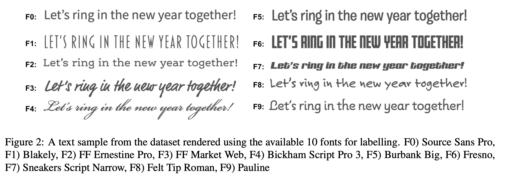

# Font prediction dataset
This is a repository for the ACL 2020 paper: 


The proposed dataset includes 1,309 short text instances from Adobe Spark. The dataset is a collection of publicly available sample texts created by different designers. It covers a variety of topics found in posters, flyers, motivational quotes and advertisements.


<center></center>

Examples from our collected dataset, visualized through fonts with the highest annotation agreements.

### Data Format
We are currently releasing annotated data in .csv files.  

| #  | text | F0  | F1 | F2 | F3 | F4 | F5 | F6 | F7 | F8 | F9 |


### Font Mappings
F0: Source-sans-pro	 
<br> F1: Blakely	
<br> F2: FF-ernestine-pro	
<br> F3: FF-market-web	
<br> F4: Bickham-script-pro-3	
<br> F5: Burbank-big	
<br> F6: Fresno	
<br> F7: Sneakers-script-narrow	
<br> F8: Felt-tip-roman	
<br> F9: Pauline
<br>



## Citation
If you use the Font corpus in your publication, please cite this paper:
```
@inproceedings{shirani2020font,
  title={Let Me Choose: From Verbal Context to Font Selection},
  author={Shirani, Amirreza and Dernoncourt, Franck and Echevarria, Jose and Asente, Paul and Lipka, Nedim and Solorio, Thamar},
  booktitle={Proceedings of the 58th Annual Meeting of the Association for Computational Linguistics},
  year={2020}
}
```
